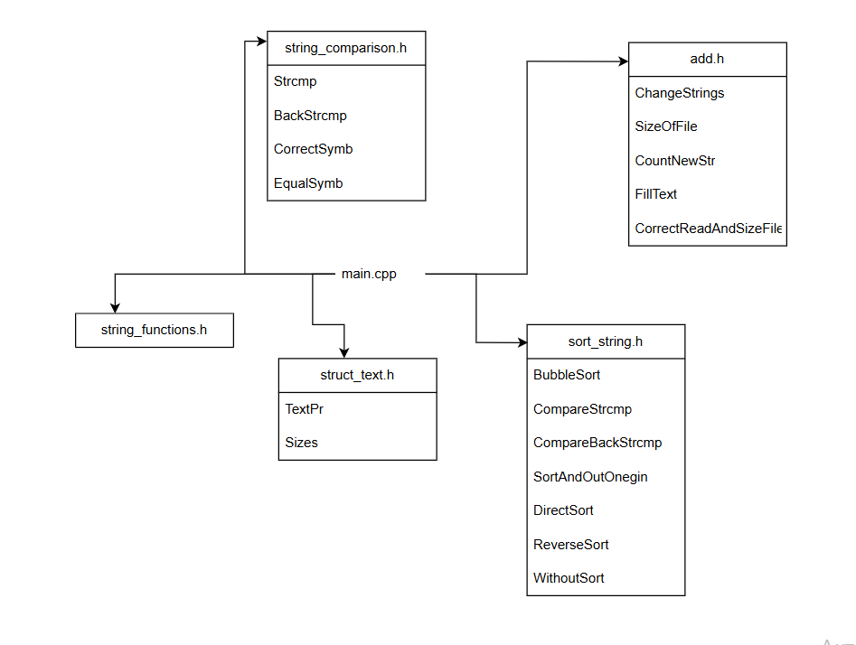

# Onegin
## Описание проекта
> Данная программа выполняет прямую и обратную сортировки текста Онегина.
> Текст произведения берётся из файла Onegin.txt, а результаты сортировок и исходный текст записываются в файл OneginOut.txt
## Файловое разбиение программы

## Qsort
